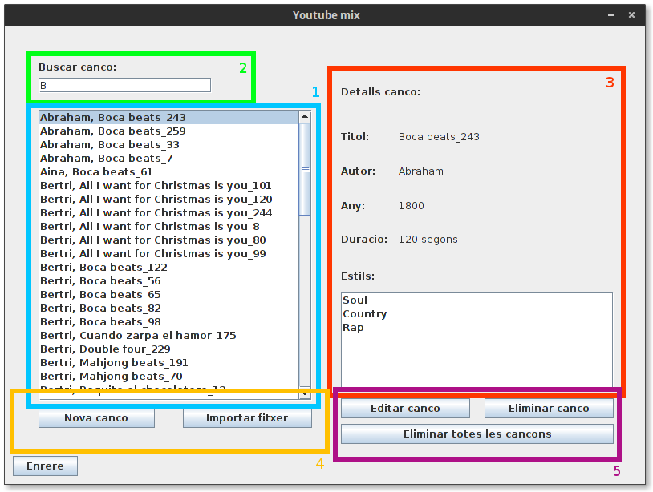

Gestió de cançons
=================

Es pot accecir a l'apartat de gestió de cançons presionant en "Gestionar Cançons" de la finestra principal.

Descripció de la interficie
^^^^^^^^^^^^^^^^^^^^^^^^^^^

1. **Llista de Cançons disponibles:** En aquest apartat es poden consultar totes les cançons disponibles al programa, si la llista es molt gran, es pot usar **el buscador (2)** per filtrar les cançons i trobar la desitjada, al seleccionar una canço en aquesta llista, es podrà veure la seva informació en la **finestra de consulta d'informació (3)**.
2. **Buscador:** Introdueixio part del nom d'una cançó o un autor per filtrar el resultat.
3. **Consulta d'informació:** En aquest apartat es mostra la informació de la cançó seleccionada.
4. **Afegir cançons:** El programa disposa de dues formes d'introduir cançons noves, individualment o a partir d'un fitxer de cançons.

    * **Introducció manual:** Presionant el botó "Nova cançó", s'accedirà a la introducció manual de cançons, La informació necesaria per a la introducció de la cançó es el nom de l'autor, el titol de la cançó, la duració en segons, l'any de publicació de la cançó i entre un i tres estils dels que la cançó formi part.
    
    .. note:: Tant el titol com el nom de l'autor de la cançó son informació bàsica per identificar la cançó, i com a tal no pot ser modificada mes endavant, comprovi que sigui correcte abans de desar la informació.
    
    * **Importar d'un fitxer:** Es poden importar cançons a partir d'un fitxer, referirse a l'apartat "Format del fitxer de cançons" per una descripció del format que ha de tenir aquest fitxer.

5. **Edició de les cançons:** En aques apartat es mostren les eines necessaries per editar i eliminar cançons, existeixen dues formes d'eliminar cançons, individualment o de forma massiva. Presionar a "Eliminar totes les cançons" elimina totes les cançons presents al programa. També es dona la opció de modificar la informació d'una cançó. Si us plau, referirse a la nota de l'apartat de introducció manual per a informació sobre el nom i l'autor de la cançó.

Format del fitxer de cançons
^^^^^^^^^^^^^^^^^^^^^^^^^^^^

Per tal de poder importar un fitxer de cançons, el fitxer ha de seguir un format concret::

    Nom Artista;Titol Cançó;any;Estil 1;Estil 2;Estil 3;Duració en segons;
    
* Una cançó per linia, acabada en ";".
* Cada apartat ha d'anar separat amb ";" i sense espais (o els espais seran interpretats com a part del camp).
* Si la cançó no te 3 estils, es pot substituir Estil 2 i Estil 3 per "-".
* Si existeix algun error en el format d'una cançó (Falta Estil 1, l'any o la duració no son numeros...), la cançó no s'importarà.

.. note:: Asseguri's de que el fitxer de cançons no acaba en una linia en blanc, això provocarà que les cançons no s'importin correctament.
