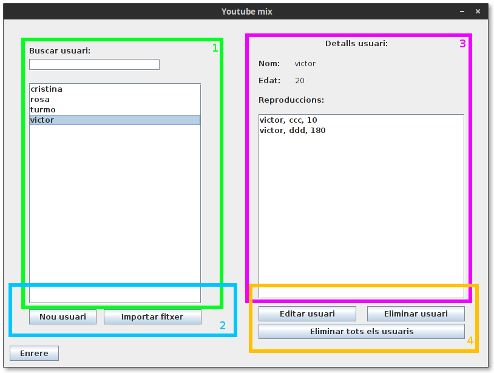

Gestió d'usuaris
================

Es pot accecir a l'apartat de gestió d'usuaris presionant en "Gestionar Usuaris" de la finestra principal.

Descripció de la interficie
^^^^^^^^^^^^^^^^^^^^^^^^^^^

1. **Llista d'usuaris:** Seleccionant un usuari d'aquesta llista es pot consultar la seva informació. La informació i resproduccions de l'usuari seleccionat es mostraran a **l'apartat d'informació de l'usuari(3)**. També es disposa d'una barra d cerca per tal de buscar l'usuari desitjat.
2. **Introducció d'usuaris:** Es poden introduir els usuaris de dues formes diferents: Individualment (Introduint un nom i una edat) o important usuaris des d'un fitxer. Per informació sobre el format del fitxer, cansultar l'apartat "Format del fitxer d'usuaris".

.. note:: En nom d'usuari es informació basica per a identificar l'usuari, i com a tal no pot ser modificat, asseguri's de que es correcte abans de desar el nou usuari.

3. **Informació sobre l'usuari seleccionat:** En aquest apartat es mostra informació sobre l'usuari seleccionat. Nom, edat i cançons reproduides.
4. **Edició dels usuaris:** En aquest apartat es mostren les eines per a editar o eliminar els usuaris. Es pot eliminar un usuari individualment o be eliminar a tots els usuaris de cop. Editar usuari permet cambiar la edat d'un usuari així com gestionar les seves reproduccions. Consultar l'apartat "Afegir reproduccions a un usuari" per a mes informació sobre com gestionar les reproduccions d'un usuari.

Format del fitxer d'usuaris
^^^^^^^^^^^^^^^^^^^^^^^^^^^
Per tal de poder importar un fitxer d'usuaris, el fitxer ha de seguir un format concret::

    nom d'usuari;edat

* Un usari per linia.
* Un nom d'usuari i una edat separat per ";" i sense espais.
* Si un usuari conté error, no serà importat (Per exemple usuari repetit o edat no numerica).

.. note:: Asseguri's de que el fitxer d'usuaris no acaba en una linia en blanc, això provocarà que els usuaris no s'importin correctament.

Afegir reproduccions a un usuari
^^^^^^^^^^^^^^^^^^^^^^^^^^^^^^^^
A part d'editar la seva edat, al editar un usuari es poden genstionar les seves reproduccions.

.. image:: ./img/edit_usr.png

1. **Editar edat:** L'edat d'un usuari es editable, es pot cambiar aquí.
2. **Edició de reproduccions:** Aquí es poden veure les reproduccions d'un usuari, seleccionant una reproducció i presionant "Eliminar reproducció", eliminarà la reproducció seleccionada. També tenim la opció d'afegir reproduccions, importantlos d'un fitxer (consultar l'apartat "Format del fitxer de reproduccions" per mes informació sobre el format del fitxer) o individualment usant el **selector de cançons (3)** .

.. note:: Si es desitja eliminar mes d'una reproducció, es pot presionar ctrl i seleccionar les reproduccions que desitgem eliminar.

3. **Selector de cançons:** Es mostren les cançons disponibles al programa. Seleccionant una cançó de les disponibles i un timestamp, podem afegir la cançó com a escoltada per a l'usuari.
4. **Desar canvis:** Qualsevol canvi fet al usuari no serà aplicat fins a desarlos. Si es torna enrere sense desar els canvis, es perdran les modificacions.

Format del fitxer de reproduccions
^^^^^^^^^^^^^^^^^^^^^^^^^^^^^^^^^^
Per tal de poder importar un fitxer d'usuaris, el fitxer ha de seguir un format concret::

    Autor;titol;timestamp
  
* Una reproducció per linia.
* Camps separats per ";" i sense espais.
* Si una reproducció conté un error, no s'importarà  .

.. note:: Asseguri's de que el fitxer de reproduccions no acaba en una linia en blanc, això provocarà que les reproduccions no s'importin correctament.
    
